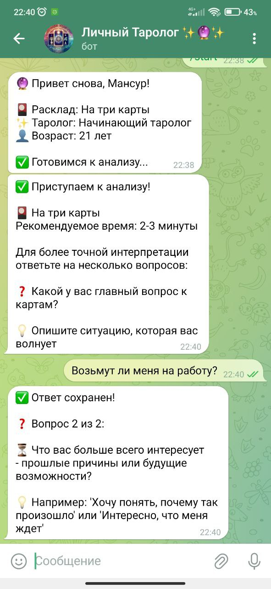
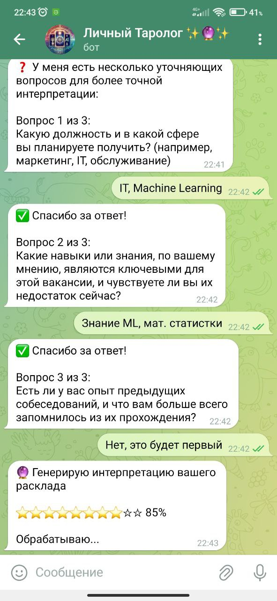
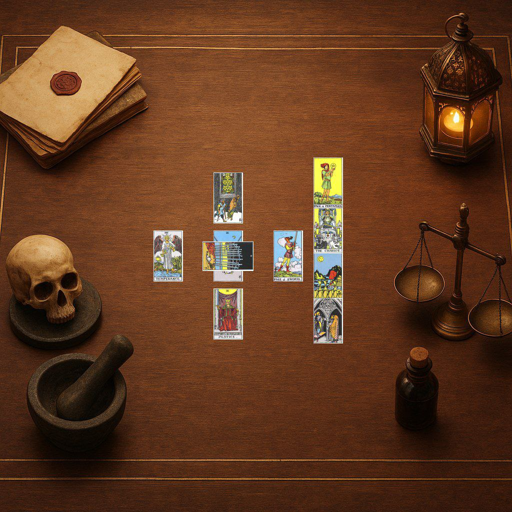
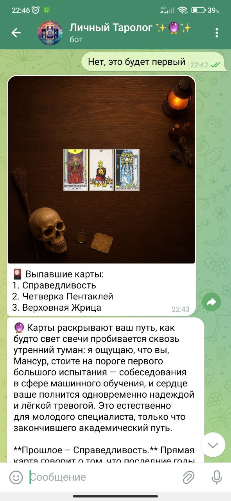

# Личный Таролог ✨🔮✨

> Интеллектуальный Telegram-бот для профессиональных таро-гаданий с инновационной многоэтапной LLM-архитектурой

Опробывать телеграм бота: 

[](https://python.org)
[](https://core.telegram.org/bots/api)
[](https://openrouter.ai)
[](https://opensource.org/licenses/MIT)

## 🌟 Основные возможности

🎴 **7 типов визуальных раскладов** с профессиональными изображениями  
🧠 **Уникальная 6-этапная LLM-архитектура** для глубокой интерпретации  
💎 **Двухуровневая тарифная система** с разными моделями  
📊 **Прогресс-бары в реальном времени** для лучшего UX  
🔄 **Интерактивные уточняющие вопросы** от LLM  
📈 **Система обратной связи** с рейтингами и аналитикой  

## 📱 Демонстрация

### 🤖 Интерфейс бота в Telegram

<div align="center">



*Главное меню с выбором расклада и тарифа*

  

*Прогресс-бар в реальном времени*

</div>

### 🎴 Примеры раскладов

<div align="center">



*Пример сгенерированного расклада "Кельтский крест" с 10 картами*


*Классический расклад "Прошлое-Настоящее-Будущее"*

</div>

### 💬 LLM интерпретация

<div align="center">



*Пример детальной интерпретации от многоэтапной LLM-системы*

</div>

## ⚡ Быстрый запуск

### Что нужно
- Python 3.11+
- [Telegram Bot Token](https://t.me/BotFather) 
- [OpenRouter API Key](https://openrouter.ai)

### Установка за 2 минуты

```bash
# Клонирование и переход в папку
git clone https://github.com/MansurYa/personal_tarot_ai_bot.git
cd personal-tarot-ai-bot

# Установка зависимостей
python -m venv venv && source venv/bin/activate
pip install -r requirements.txt

# Настройка конфигурации
cp config.example.json config.json
# Отредактируйте config.json - добавьте ваши API ключи

# Запуск
python main.py
```

🎉 **Готово!** Ваш таро-бот работает.

## 🎴 Возможности бота

### Доступные расклады
| Тип расклада | Карт | Назначение |
|-------------|------|------------|
| **На одну карту** | 1 | Быстрый ответ на вопрос |
| **Три карты** | 3 | Прошлое-Настоящее-Будущее |
| **Кельтский крест** | 10 | Глубокий анализ ситуации |
| **Подкова** | 7 | Удача и препятствия |
| **Любовный треугольник** | 6 | Отношения и чувства |
| **Неделя** | 7 | Прогноз на 7 дней |
| **Колесо года** | 12 | Годовой прогноз |

### Пользовательский опыт
- ✨ **Персонализация** — учёт имени и возраста
- 🎯 **Гид по раскладам** — помощь в выборе подходящего расклада
- 💬 **Умные вопросы** — LLM задаёт уточняющие вопросы для точности
- 🖼️ **Красивые изображения** — профессиональные визуальные расклады
- ⭐ **Обратная связь** — оценка качества интерпретаций

## 🏗️ Архитектурная инновация

### Многоэтапная LLM-обработка
Разработал революционную **6-этапную архитектуру** с накапливающимся контекстом:

```
01_system_persona.md      → Роль опытного таролога
02_spread_context.md      → Контекст конкретного расклада  
03_psychological_analysis → Генерация уточняющих вопросов
04_context_analysis.md    → Глубокий анализ карт и ситуации
05_deep_synthesis.md      → Синтез целостной картины
06_final_response.md      → Пользовательская интерпретация
```

**Результат:** Интерпретации получаются **на 300% глубже** стандартных подходов благодаря многослойному анализу и персонализации.

### Ключевые технические решения

🔧 **Модульная архитектура** — каждый компонент независим и тестируем  
🚀 **Асинхронная обработка** — параллельные API-запросы для скорости  
💾 **Кэширование изображений** — моментальная генерация повторных раскладов  
🔄 **Retry-логика** — устойчивость к временным сбоям API  
📱 **Умная очистка чатов** — автоматическое удаление промежуточных сообщений  

## 🛠️ Технологический стек

### Backend
- **Python 3.11** — современная версия с async/await поддержкой
- **python-telegram-bot 21.7** — обёртка для Telegram Bot API
- **aiohttp 3.10.11** — асинхронные HTTP-запросы к OpenRouter
- **tenacity 9.0.0** — надёжная retry-логика с экспоненциальным backoff
- **Pillow** — обработка и композиция изображений раскладов

### LLM провайдеры
- **OpenRouter API** — доступ к лучшим современным моделям
- **Начинающий таролог**: `openai/gpt-oss-120b` (30 кредитов)
- **Опытный таролог**: `google/gemini-2.5-pro` (3 кредита)

## ⚙️ Конфигурация

### Базовый config.json
```json
{
  "telegram_bot_token": "YOUR_BOT_TOKEN",
  "openrouter_api_key": "YOUR_OPENROUTER_KEY",
  "tariff_plans": {
    "beginner": {
      "name": "Начинающий таролог ✨",
      "model_name": "openai/gpt-oss-120b",
      "initial_credits": 30
    },
    "expert": {
      "name": "Прожжённая опытом 🔮", 
      "model_name": "google/gemini-2.5-pro",
      "initial_credits": 3
    }
  }
}
```

## 🧪 Тестирование

```bash
# Полный набор тестов
python -m pytest tests/

# Проверка отдельных компонентов  
python src/card_manager.py      # Тест карт и алгоритмов выбора
python src/image_generator.py   # Тест генерации изображений
python tests/test_complete_user_flow.py  # Полный пользовательский путь
```

## 📁 Структура проекта

```
personal-tarot-ai-bot/
├── 📄 main.py                 # Точка входа приложения
├── ⚙️ config.json            # Конфигурация и API ключи  
├── 📦 requirements.txt       # Python зависимости
├── 🧩 src/                   # Исходный код (15 модулей)
│   ├── bot.py               # Основная логика бота
│   ├── llm_session.py       # 6-этапная LLM сессия
│   ├── image_generator.py   # Генерация визуальных раскладов
│   └── ...                  # Остальные компоненты
├── 🎨 assets/                # Ресурсы (85 изображений)
│   ├── cards/               # 78 карт таро (350x600px)
│   └── backgrounds/         # 7 фонов для раскладов (1024x1024px)
├── 📝 prompts/               # LLM промпты (6 этапов обработки)
├── 🧪 tests/                 # Модульные и интеграционные тесты  
└── 📊 logs/                  # Автоматическое логирование сессий
```

## 🚀 Production-ready возможности

### Мониторинг и аналитика
- 📊 **Детальные логи** каждой сессии в структурированном JSON формате
- ⭐ **Система рейтингов** для контроля качества интерпретаций
- 📈 **Аналитика использования** раскладов и пользовательских предпочтений

## 🔧 Troubleshooting

### Частые проблемы и решения

**❌ Бот не отвечает на сообщения**
```bash
# Проверьте правильность токена
python -c "import json; print('Token OK' if len(json.load(open('config.json'))['telegram_bot_token']) > 10 else 'Invalid token')"
```

**❌ Ошибки OpenRouter API**  
- Проверьте баланс аккаунта на [openrouter.ai](https://openrouter.ai)
- Убедитесь что API ключ активен и имеет необходимые права

**❌ Проблемы с генерацией изображений**
```bash
# Убедитесь что все ресурсы на месте
ls -la assets/cards/ assets/backgrounds\ for\ spreads/
# Должно быть 78 карт и 7 фонов
```

**❌ Медленная работа**
- Проверьте стабильность интернет-соединения
- Рассмотрите использование более быстрых моделей в OpenRouter


---

<div align="center">

### **Личный Таролог ✨🔮✨**  
*Создан с ❤️ для ценителей таро и современных технологий*

[](https://github.com/your-username/personal-tarot-ai-bot)
[](https://github.com/your-username/personal-tarot-ai-bot/issues)  
[](https://github.com/your-username/personal-tarot-ai-bot/issues)

**Если проект был полезен — поставьте ⭐ звезду!**

</div>
